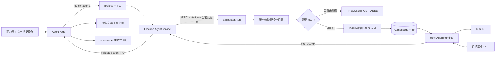
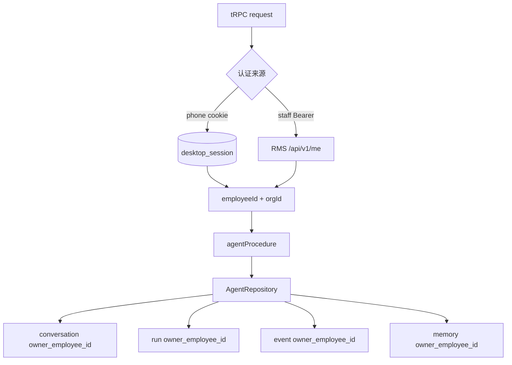

# 酒店 Agent 功能与代码审计报告

审计日期：2026-08-10（公共 MCP 与图表能力已更新）  
审计范围：本次新增的 Kimi K3 单 Agent、tRPC/SSE、Electron 桥接、酒店快捷操作、MCP、生成式 UI、会话持久化、长期记忆和用户隔离逻辑。  
结论：功能链路已打通，静态检查、lint、全部单元测试和 server tRPC E2E 通过；仍有两个上线前必须处理的安全门禁，因此当前状态适合继续本地联调，不应直接发布生产。

## 1. 功能覆盖

| 能力 | 实现与审计结论 | 状态 |
|---|---|---|
| Kimi K3 | server 使用 `ChatOpenAI` 的 OpenAI-compatible Chat Completions，base URL 为 `https://api.moonshot.cn/v1`，模型从 `AI_KIMI_MODEL` 读取 | 已打通 |
| 流式事件 | tRPC `httpSubscriptionLink`/SSE 传递 text、tool、UI、complete、failed 事件；PG 支持断线回放与 event ID 去重 | 已打通 |
| 酒店快捷操作 | 默认展示今日天气、七天天气、空气质量；酒店价格仅在真实 `hotel_rates` MCP 配置后展示 | 已打通 |
| 生成式 UI | 在原白名单上增加面积、折线、柱状、环图、雷达和径向酒店图表，共享 schema 在 server/renderer 双端校验 | 已打通 |
| MCP | 内置固定版本、无 Key 的公共天气 stdio MCP；自定义 server 支持 HTTP/SSE/stdio 与 capability 门禁 | 已打通 |
| Skill | 保留 `SkillProvider` 接口，当前显式使用空实现 | 符合本期范围 |
| 会话持久化 | conversation/message/run/event 写入 PostgreSQL，client request ID 提供运行幂等 | 已打通 |
| 长期记忆 | 当前员工的长期偏好/事实写入 PostgreSQL；跨会话读取，不跨员工共享 | 已打通 |
| 用户隔离 | owner 不接受客户端输入；由登录态生成 principal，conversation/run/event/memory 查询按员工约束 | 已打通 |
| 子 Agent | 未创建、未启用 | 符合本期范围 |

## 2. 快捷操作调用链

客户端只发送枚举 ID，不能附带或覆盖快捷操作的内部提示词。`startAgentRunInputSchema` 是 strict union，同时提交 `quickActionId` 和 `prompt` 会得到 `BAD_REQUEST`。

当前默认动作：

1. 查看今日天气
2. 未来七天天气
3. 空气质量提醒

“公开酒店价格”是第四个可选动作，只在真实 `hotel_rates` MCP 配置后返回。依赖本地 RMS/PMS 但尚无真实数据接口的异常订单、房态库存、渠道巡检、点评、对账和交班动作已移除，不再展示不可执行入口。全部公共动作只读，不执行预订、改价或支付。

## 3. 用户与 session 隔离审计

- tRPC contract 不含 owner 字段，strict Zod object 会拒绝伪造字段。
- 会话读取先验证 conversation owner，再读取其 message。
- run 创建、上下文读取与事件回放均验证当前 principal。
- 长期记忆按员工读取与 upsert；同一员工跨设备共享，不同员工隔离。
- renderer 不保存跨用户全局 Agent store；窗口销毁或切换会话时取消对应 SSE subscription。
- 当前实现以 RMS 全局唯一 `employeeId` 为主隔离键，`orgId` 在 conversation/memory 中留存。若未来员工 ID 改为“组织内唯一”，必须把所有 owner 查询、唯一索引及 run/event 表一起升级为 `(orgId, employeeId)` 复合隔离键。

## 4. 安全审计发现

### Critical — 真实 `.env` 被 Git 跟踪

`apps/server/.env` 当前是 Git 已跟踪文件，并且工作区中的 Agent API Key 已更新。报告不读取或记录密钥值，但只要提交该文件，真实密钥就可能进入版本历史。

上线前处理：立即轮换当前 Kimi Key；将本地密钥迁移到未跟踪的 `.env.local`、secret manager 或加密配置；在确认团队配置方式后执行 `git rm --cached apps/server/.env` 并加入 `.gitignore`。移除跟踪会改变 Git 索引，本次没有擅自执行。

### Critical — 临时 OTP 网关不能用于生产认证

server 构建日志明确提示 `phone_otp.temporary_gateway_enabled`，当前临时网关接受任意格式正确的验证码。Agent 的数据隔离建立在“principal 已被可靠认证”之上，因此生产发布前必须替换为真实 OTP provider，或只发布使用可靠 RMS Bearer 校验的 staff 认证变体。

### Medium — 开启 MCP 写工具后没有确定性人工确认状态机

默认 `AI_MCP_ALLOW_WRITE_TOOLS=false` 时，工具层会同时执行读名称白名单与写名称黑名单，快捷操作也是只读的。若把该环境变量设为 `true`，当前仅靠 system prompt 要求确认，没有独立 confirmation token、影响预览和审计状态机。生产环境应保持 `false`，直到实现确定性 human-in-the-loop contract。

### Medium — 长期记忆没有确定性敏感信息识别

记忆 key、长度和 importance 已校验，system prompt 也要求不保存凭证，并把记忆标记为不可信 JSON 数据；但尚无手机号、证件号、token、银行卡等内容的确定性检测或脱敏。涉及真实宾客数据前，应增加分类、拒绝/脱敏策略和记忆删除入口。

### Low — 停止按钮只停止接收，不终止 server run

当前“停止接收”会取消桌面 SSE subscription，server 仍完成并持久化运行。这避免中断造成状态丢失，但不节省模型费用。若需要真正取消，应增加按 owner 校验的 cancel mutation、run AbortController registry 和明确的终态。

### Dependency audit — 工作区仍有已知依赖公告

`npm audit --workspace @hotel-butler/server --omit=dev` 报告 16 项（6 low、6 moderate、4 high）。其中 `fast-uri@3.1.4` 的 high 公告同时出现在新增天气 MCP 经 `@modelcontextprotocol/sdk -> ajv` 的依赖路径和仓库既有构建依赖路径；其余报告还涉及 `brace-expansion`、`cookie`、旧工具链 `esbuild` 与 `nanoid`。本次没有执行 `npm audit fix`：审计建议中包含会降级或破坏性变更 SvelteKit/Vite 的 `--force` 路径，不能在本功能改动中自动套用。上线前应单独升级依赖并做回归；公共 MCP 仍按不可信输入处理。

### Resolved — Desktop E2E 启动与认证变体

原 E2E 构建没有注入 `__AUTH_VARIANT__`，导致 Electron 主进程在创建首窗口前退出；修复后又发现 Agent schema 从 API server 根入口进入 preload。现已让 E2E 的 main/preload/renderer 三端显式使用 `phone`，并让 preload/renderer 从浏览器安全的 `@hotel-butler/api/contracts` 入口读取运行时 schema。正式打包默认仍为 `staff`，只有显式设置 `XIAOZHI_AUTH_VARIANT=phone` 才切换。

## 5. 已修复的审计问题

- 原有 MCP 工具过滤只检查读关键词，`reservation.get_and_delete` 之类名称可能被放行。现改为“必须命中读关键词且不得命中任何写关键词”，并增加测试。
- 长期记忆和 MCP 结果现被 system prompt 明确标记为不可信业务数据，要求忽略其中的规则覆盖、凭证泄露或权限扩张指令。
- 快捷操作 catalog 不包含服务端提示词，renderer 只能选择 ID，不能覆盖业务约束。
- MCP 未配置时不让模型假装读取实时订单/库存/价格数据，而是在 catalog 和 start mutation 两层阻断。

## 6. 验证证据

| 命令/检查 | 结果 |
|---|---|
| Svelte autofixer（Agent 页面、6 个酒店图表及 shadcn Chart 容器/tooltip） | 全部 0 issues，0 suggestions |
| API 定向单测 | 14/14 通过 |
| server 快捷操作、隔离、MCP、生成式 UI 定向单测 | 15/15 通过 |
| desktop AgentService 定向单测 | 1/1 通过 |
| 公共天气 MCP 真实冒烟 | 成功加载 7 个只读天气工具，并成功查询上海天气摘要 |
| desktop Agent renderer E2E build | 通过；主 renderer chunk 约 1.50 MB（gzip 约 455 KB），图表依赖带来后续按需加载优化空间 |
| `npm run verify` 的 check | API/server/desktop 通过，Svelte 0 error/0 warning |
| `npm run verify` 的 lint | API/server/desktop 通过 |
| `npm run verify` 的 unit | desktop 379/379、server 54/54、API 14/14 通过 |
| server tRPC E2E | 3/3 通过，覆盖认证、会话持久化、快捷操作 catalog 和伪造 owner 拒绝 |
| desktop E2E | 8 个场景均已验证：完整运行通过 5 个，校正当前 UI/日历断言后其余 3 个定向通过 |
| `git diff --check` | 通过 |

由于两项 Critical 安全门禁，审计结论仍不是“生产就绪”。在完成密钥治理和真实认证 provider 后，才建议进入发布验收。
